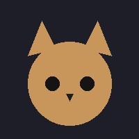

# 🐾 Catscii

Turn any image into ASCII art from the command line — with a playful cat theme. One dependency: [Pillow](https://pypi.org/project/Pillow/).

```
 /\_/\
( o.o ) Catscii
 > ^ <  turn any image into ASCII art
```

## Example

**Input**



**Output** (`--style blocks`)

```
████████████████████████████████████████████████████████████
█████████████████▓▒██████████████████████▓▒█████████████████
████████████████▒░░░▓██████████████████▓▒░░▒▓███████████████
██████████████▓░░░░░░░▓███████████████▒░░░░░░▓██████████████
```

Try it yourself in the browser: **[live demo](https://hackercat-git.github.io/Catscii/)** (runs entirely client-side — nothing is uploaded).

## Installation

**Clone + pip:**

```bash
git clone https://github.com/Hackercat-git/Catscii.git
cd Catscii
pip install pillow
```

**Install as a package** (makes `catscii` available as a global command):

```bash
pip install .
```

**With optional numpy backend** (~10× faster rendering on large images):

```bash
pip install ".[fast]"
```

## Usage

```bash
python catscii.py photo.jpg
python catscii.py photo.jpg --width 160 --style blocks
python catscii.py photo.jpg --style paws --color
python catscii.py photo.jpg --invert
python catscii.py photo.jpg --grayscale
python catscii.py photo.jpg --width 200 --height 60
python catscii.py photo.jpg --resize pixel   # crisp edges for pixel art
python catscii.py photo.jpg -o art.txt
python catscii.py photo.jpg -o art.html --color
python catscii.py --banner
```

| Flag | Description | Default |
|---|---|---|
| `--width` | Output width in characters | `100` |
| `--height` | Output height in lines (default: auto from aspect ratio) | auto |
| `--style` | `standard`, `blocks`, `paws`, `binary`, or `shade` | `standard` |
| `--color` | Render using the image's original colors (ANSI in terminal, inline styles in HTML) | off |
| `--invert` | Invert brightness mapping — useful for images with light backgrounds | off |
| `--grayscale` | Convert image to grayscale before rendering | off |
| `--resize` | Resampling filter: `smooth` (LANCZOS) or `pixel` (NEAREST, for pixel art) | `smooth` |
| `-o`, `--output` | Save to a `.txt` or `.html` file instead of printing | — |
| `--banner` | Show the Catscii banner | — |

## Styles

- **standard** — the classic `@%#*+=-:. ` density ramp
- **blocks** — Unicode block shades (`█▓▒░`) for a sharper look
- **paws** — cat-themed ramp (`WM@#&8*o+=-:,.`), terminal-safe
- **binary** — `10` only, for a "matrix" effect
- **shade** — smooth box-drawing ramp (`■▪▫◾◽□`) for a softer look

## Tests

```bash
python -m unittest discover tests
```

## License

MIT
